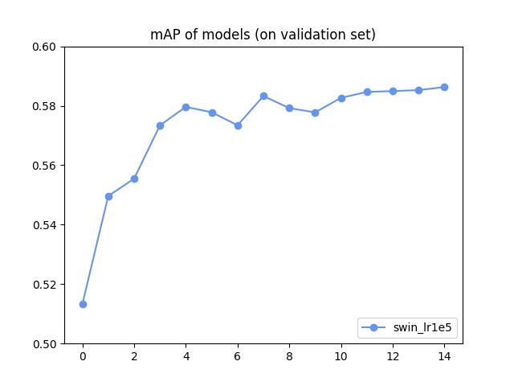

# CVPDL-HW1
## Methods
### Model : DINO 

* The repository is cloned from the [official implementation](https://github.com/IDEA-Research/DINO) of the [DINO](https://arxiv.org/abs/2203.03605) and is modified to meet the requirements of CVPDL-HW1 (Marked by `# Modification for CVPDL-hw1`)


## Environment
```sh
(Optional) git clone https://github.com/irisowo/CVPDL-HW1.git

cd CVPDL-HW1

# This will setup a conda environment and download checkpoint_best_regular.pth
bash ./build_Dino.sh
```
## Evaluate
* After running ./build_Dino.sh, your are now under DINO/
### Way1
* Simply evaluate the provided output.json
```sh
python ../hw1_dataset/evaluate.py ../output.json $PATH_GROUND_TRUTH
```
### way 2
* Get ouput.json from my pretrained model
  ```sh
  # Run testing data on my pre-trained weights
  bash scripts/DINO_test.sh
  
  # copy ouput.json to CVPDL_HW1
  cp logs/submission_output/output.json ..
  
  # evaluate the testing result
  python ../hw1_dataset/evaluate.py ../output.json $PATH_GROUND_TRUTH
  ```

## Run
* (Optional) Before running models, download checkpoints from [my google drive](https://drive.google.com/drive/folders/1PpPq0CuQjQeFZGVJ8KKrnnZVqShFdjK7?usp=sharing) or [official google drive](https://drive.google.com/drive/folders/1qD5m1NmK0kjE5hh-G17XUX751WsEG-h_)
* Otherwise :
  * My pretrained weights will be automatically downloaded when runnung  `DINO_test_swin.sh`
  * The officially pretrained weights will be automatically downloaded when runnung  `DINO_train_swin.sh`

```sh
cd DINO
# Get the output.json of hw1-dataset/test
# Default output path : logs/submission_output/output.json
bash scripts/DINO_test.sh

# Get the bounded images of hw1-dataset/test without generating output.json
# Default output path : figs/imgs/IMG_xxxx.jpeg
bash scripts/DINO_visual.sh

# Train the model
# Default output path of model : logs/swin_lr1e5/xxxx.pth
nohup bash scripts/DINO_train_swin.sh > ./logs/swin_lr1e5.txt 2> ./logs/swin_
lr1e5.err &
# or
bash scripts/DINO_train_swin.sh

# Evaluate certain checkpoints on validation set
bash scripts/DINO_eval.sh
```

* **Note** : For all scripts under DINO/scripts, you can manually configure the arguments at the beginning, for example :  
  * DINO_test.sh
    ```sh
    # Define model_name and pathes
    model_name="swin_lr1e5"

    coco_path="../hw1_dataset"
    output_dir_path="logs/submission_output"

    config_path="config/DINO/DINO_4scale_swin.py"
    pretrain_model_path="logs/${model_name}/checkpoint0014.pth"

    # Download pretrined weights
    ...

    # Execute main.py with "--test"
    ...
    ```
## Result
```sh
# read test_coco_eval_bbox from "logs/{model_name}/log.txt"
python analyze.py
```
* DINO with Swin-L backbone performs better than the onw with ResNet.



## Directory Structure
```
CVPDL-HW1/
  ├── hw1_dataset/
  |
  ├── build_DINO.sh (see Environment)
  |
  └── DINO/
      |
      ├── main.py
      ├── engine.py
      |
      ├── scripts/ (see Run)
      |   ├──DINO_test.sh
      |   ├──DINO_visual.sh
      |   ├──DINO_train_swin.sh
      |   ├──DINO_train.sh
      |   └──DINO_eval.sh
      |
      ├── logs : (Outputs of models)
      |   |   
      |   ├──R50-xx/
      |   |   ├──test/output.json
      |   |   └──checkpoint_best_regular.pth
      |   |
      |   └──swin_lr1e5/
      |       ├──test/output.json
      |       └──checkpoint_best_regular.pth
      |
      ├── config/DINO
      |   ├──DINO_4scale_swin.py
      |   └──DINO_4scale.py
      |
      └── analyze.py
          : plot the mAP line chart according to logs/{model}/log.txt
```
